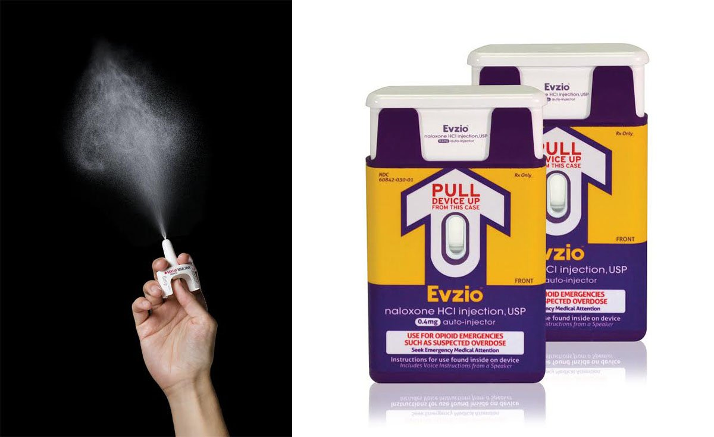
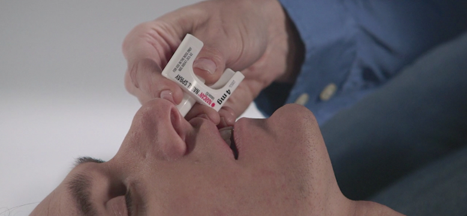

# Narcan Now~ A crowdsourced way to help!
 

## Table of Contents:
1. [About Narcan-Now](#Project description)
2. [Tools we used](#Tools we used)
3. [Meet the Team](#Meet the Team)
4. [Resources](#Resources)

### Project description:
We found the following challenge on [], the hub for listing challenge and prize competitions, all of which are run by more than 100 agencies across federal government. These problem-solving events include idea, creative, technical and scientific competitions in which U.S. federal agencies invite the public’s help to solve perplexing mission-centric problems.

#### Our challenge description:
We want to apply a crowdsourced community solution to help people get Narcan when they need it. By the time we are finished with this presentation, someone will have died from a drug overdose from such drugs as oxycontin, heroin or fentanyl. That’s the reality today. In 2015 the US had over 33,000 people die from Opioid overdoses according to the CDC. Half of these from prescription painkillers. In 2016, more Americans died from an overdose than in the Vietnam War. It is an epidemic and was just declared a public health emergency as early as yesterday. It is not easy to talk about this, as many of us are affected personally, myself included.

However, there is an effective way to bring someone back from the brink. It is called Narcan and it is an opioid antagonist. Narcan can be administered through a small nasal inhaler by virtually anyone. It works by binding itself to the body’s opioid receptors in the brain. The compound has more affinity to these receptors than the opioids do. Thus blocking the drug from being absorbed in further and effectively reversing the OD symptoms such as respiratory failure.  Our hope is to provide people who want to help with multiple resources for them to turn to when they recognize that someone is having an overdose.

Our app Narcan Now is a clean, simple interface that utilizes React for rendering live updates and Google Maps API for up to date location data. The idea and focus of our app really focuses on two goals. One is showing the locations of Narcan and providing an interface for a person who wants to help someone who is in the middle of OD. Though it should be noted that no matter how close a potential source can be one should always call 911 first.

#### Tools we used:
 * **Google Maps API**: A wonderfully written and simple to use API that allows us to work with google maps.
 https://developers.google.com/maps/documentation/javascript/

 * **jest**: A testing framework built on Jasmine that plays nice with React for our testing environment.          http://facebook.github.io/jest.

 * **superagent**: SuperAgent is a small progressive client-side HTTP request library, and Node.js module with the same API, sporting many high-level HTTP client features.
 http://visionmedia.github.io/superagent.

 * **babel** : A transpiler that allows us to use the newest and greatest with Javascript.
 https://babeljs.io/

 * **Node.js**: Node.js® is a JavaScript runtime built on Chrome's V8 JavaScript engine. Node.js uses an event-driven, non-blocking I/O model that makes it lightweight and efficient. Node.js' package ecosystem, npm, is the largest ecosystem of open source libraries in the world.
 https://nodejs.org/en/

 * **express**: Express is a minimal and flexible Node.js web application framework that provides a robust set of features for web and mobile applications.
 http://expressjs.com.

 * **MongoDB**: MongoDB is a document database with the scalability and flexibility that you want with the querying and indexing that you need
 https://www.mongodb.com/what-is-mongodb

 * **mongoose** : Mongoose provides a straight-forward, schema-based solution to model your application data. It includes built-in type casting, validation, query building, business logic hooks and more, out of the box.
 http://mongoosejs.com/

 * **react** : React makes it painless to create interactive UIs. Design simple views for each state in your application, and React will efficiently update and render just the right components when your data changes.
 https://reactjs.org/

 * **react-dom**: The react-dom package provides DOM-specific methods that can be used at the top level of your app and as an escape hatch to get outside of the React model if you need to. Most of your components should not need to use this module.
 https://www.npmjs.com/package/react-dom.

 * **react-redux**: It helps you write applications that behave consistently, run in different environments (client, server, and native), and are easy to test. On top of that, it provides a great developer experience, such as live code editing combined with a time traveling debugger.
 https://www.npmjs.com/package/react-redux.

 * **webpack** : Is a module bundler thats purpose is to bundle Javascript files for usage in a browser.
 https://www.npmjs.com/package/webpack.

### Meet the Team:
* Shaun Wahle

Shaun is finishing Full-Stack Javascript Certificate at the Code Fellows Dev Bootcamp. He is currently working on supplementing his education through free-lance work and self-study. Web services and development are two of his passions, meaning he can work on anything from the back end of a web solution (NodeJS) to the front end (HTML, CSS, Javascript). When not coding, he can be found enjoying his homemade churros, traveling, motorcyling, or giving wine tasting classes.

 

* Madeline Stevens

Madeline grew up in Seattle. She moved to Dallas, Texas for a journalism internship and ended up staying there for four years. After gaining skills in storytelling, photojournalism and videography she applied to work at Apple retail the day after Steve Jobs passed. She started working as a technician but soon became a trainer, working with other people and their creative projects, facilitating workshops and kids field trips. Now that she is back home she wants to help improve software for people with accessibility needs and has plans to continue exposing more kids to coding after graduation at a school in West Seattle.

 

* Tim Turner

Tim is a software developer in training with a background in Information Technology and weather forecasting. He enjoys the outdoors, playing with his dog, and spending time with his fiancée.

  

### Resources:
#### APIs
* https://developers.google.com/maps/
* https://www.twilio.com
* https://developer.mozilla.org/en-US/docs/Web/API/Geolocation/Using_geolocation

#### Narcan information
* https://www.narcan.com/pdf/NARCAN-Quick-Start-Guide.pdf
* http://www.npr.org/sections/thetwo-way/2017/10/26/560180901/walgreens-stocks-narcan-opioid-overdose-spray-in-all-pharmacies
